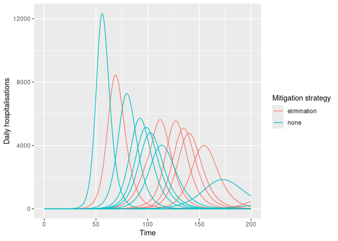

<!-- README.md is generated from README.Rmd. Please edit that file -->

# daedalus.compare: Run Multiple DAEDALUS Scenarios of Pandemic Outcomes

<!-- badges: start -->

[](https://www.repostatus.org/#concept)
[](https://github.com/jameel-institute/daedalus.compare/actions/workflows/R-CMD-check.yaml)
[](https://app.codecov.io/gh/jameel-institute/daedalus.compare?branch=main)
[](https://CRAN.R-project.org/package=daedalus.compare)
<!-- badges: end -->

*daedalus.compare* is a helper package that wraps the *daedalus* package
for epi-macroeconomic modelling, and is primarily focused on making it
easy to run multiple scenarios of pandemic mitigation strategies along
with uncertainty in infection parameters.

## Installation

You can install the development version of *daedalus.compare* from the
Jameel Institute R-universe (recommended) or from GitHub.

``` r
# installation from R-universe
install.packages(
  "daedalus.compare", 
  repos = c(
    "https://jameel-institute.r-universe.dev", "https://cloud.r-project.org"
  )
)

# installation from GitHub using {pak}
install.packages("pak")
pak::pak("jameel-institute/daedalus.compare")
```

You can also install

## Quick start

This example shows how to model multiple pandemic response scenarios in
the U.K. with uncertainty in $R_0$ of an H1N1-like infection. **Note
that** *daedalus.compare* only supports running
`daedalus::daedalus_multi_infection()` using
`daedalus.compare::run_scenarios()` at present.

``` r
library(daedalus)
library(daedalus.compare)

# make list of infection objects with R0 of 1.0 -- 2.0 with skewed distribution
set.seed(1) # for reproducible results
infection_list <- make_infection_samples(
  "influenza_2009",
  param_distributions = list(
    r0 = distributional::dist_beta(2, 5)
  ),
  param_ranges = list(
    r0 = c(1.0, 2.0)
  ),
  samples = 10
)

elimination <- daedalus_timed_npi(
  start_time = 10,
  end_time = 100,
  openness = list(
    daedalus.data::closure_strategy_data[["elimination"]]
  ), # must be a list
  "GBR" # must specify country
)

# run multiple scenarios of outputs
output <- run_scenarios(
  "GBR", infection_list,
  response = list(
    none = NULL,
    elimination = elimination
  ),
  time_end = 200
)

# view output which is a data.table
output
#>       response time_end     output
#>         <char>    <num>     <list>
#> 1:        none      200 <list[10]>
#> 2: elimination      200 <list[10]>

# get epi-curve data
disease_tags <- sprintf("sample_%i", seq_along(infection_list))
epi_curves <- get_epicurve_data(output, disease_tags)
```

``` r
# plot epi-curve data showing daily hospitalisations
library(dplyr)
#> 
#> Attaching package: 'dplyr'
#> The following objects are masked from 'package:stats':
#> 
#>     filter, lag
#> The following objects are masked from 'package:base':
#> 
#>     intersect, setdiff, setequal, union
library(ggplot2)

epi_curves %>%
  filter(measure == "daily_hospitalisations") %>%
  ggplot(aes(time, value)) +
  geom_line(
    aes(col = response, group = interaction(tag, response))
  ) +
  labs(
    x = "Time", y = "Daily hospitalisations",
    col = "Mitigation strategy"
  )
```



## Related projects

*daedalus.compare* is intended to be a helper package for the
macro-economic and epidemiological [modelling package
*daedalus*](https://github.com/jameel-institute/daedalus), also
developed at the Jameel Institute.

The DAEDALUS model was originally developed in Haw et al.
([2022](#ref-haw2022)), and the R implementation of the model is based
on a [project on the economics of pandemic
preparedness](https://github.com/robj411/p2_drivers).

## References

<div id="refs" class="references csl-bib-body hanging-indent"
entry-spacing="0">

<div id="ref-haw2022" class="csl-entry">

Haw, David J., Giovanni Forchini, Patrick Doohan, Paula Christen, Matteo
Pianella, Robert Johnson, Sumali Bajaj, et al. 2022. “Optimizing Social
and Economic Activity While Containing SARS-CoV-2 Transmission Using
DAEDALUS.” *Nature Computational Science* 2 (4): 223–33.
<https://doi.org/10.1038/s43588-022-00233-0>.

</div>

</div>
