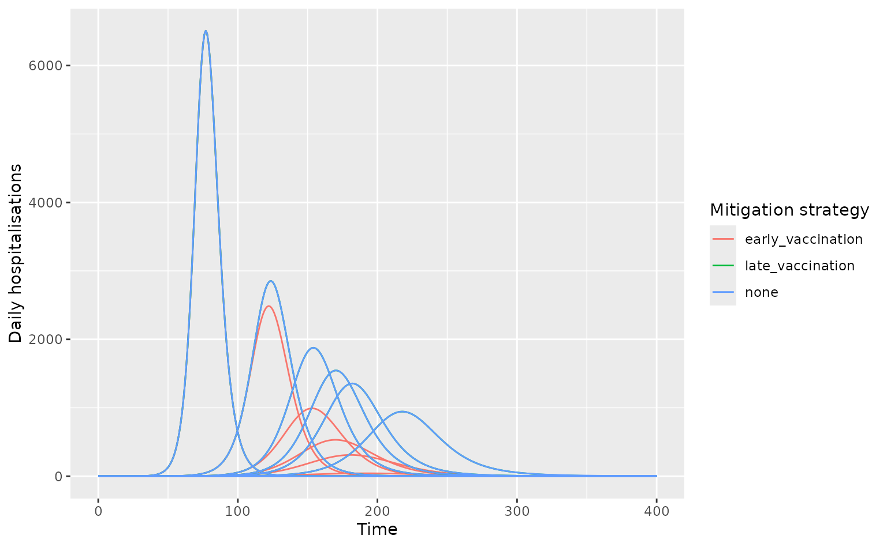

# Comparing outcomes across vaccination strategies

This example shows how to compare across multiple vaccination scenarios
with uncertainty in \\R_0\\, for an H1H1-like infection in the U.K. The
example is aimed at showing how *daedalus* and *daedalus.compare* can be
used for vaccination impact modelling.

``` r

library(daedalus) # needed for custom vaccination objects
library(daedalus.compare)

country <- "GB"

# make list of infection objects
set.seed(1)
infection_list <- make_infection_samples(
  "influenza_2009",
  param_distributions = list(
    r0 = distributional::dist_beta(2, 5)
  ),
  param_ranges = list(
    r0 = c(1.0, 2.0)
  ),
  samples = 10
)

# create three vaccination scenarios including a no-vaccination scenario
# this example uses pre-canned scenarios from daedalus
no_vaccination <- NULL
late_vaccination <- daedalus_vaccination("low", country)
early_vaccination <- daedalus_vaccination("high", country)
```

Run
[`run_scenarios()`](https://jameel-institute.github.io/daedalus.compare/reference/run_scenarios.md),
passing the vaccination scenarios to the argument `vaccination_strategy`
as a list.

``` r

# run over a period of 400 days as late vaccination
# begins on day 300
output <- run_scenarios(
  country, infection_list,
  vaccination_strategy = list(
    none = no_vaccination,
    late_vaccination = late_vaccination,
    early_vaccination = early_vaccination
  ),
  time_end = 400
)

# view output which is a data.table with a nested list column
output
#>    response       vaccination time_end     output
#>      <char>            <char>    <num>     <list>
#> 1:     none              none      400 <list[10]>
#> 2:     none  late_vaccination      400 <list[10]>
#> 3:     none early_vaccination      400 <list[10]>

# get epi-curve data
disease_tags <- sprintf("sample_%i", seq_along(infection_list))
epi_curves <- get_epicurve_data(output, disease_tags)
```

``` r

# plot epi-curve data showing daily hospitalisations
library(dplyr)
#> 
#> Attaching package: 'dplyr'
#> The following objects are masked from 'package:stats':
#> 
#>     filter, lag
#> The following objects are masked from 'package:base':
#> 
#>     intersect, setdiff, setequal, union
library(ggplot2)

epi_curves %>%
  filter(measure == "daily_hospitalisations") %>%
  ggplot(aes(time, value)) +
  geom_line(
    aes(col = vaccination, group = interaction(tag, vaccination))
  ) +
  labs(
    x = "Time", y = "Daily hospitalisations",
    col = "Mitigation strategy"
  )
```


