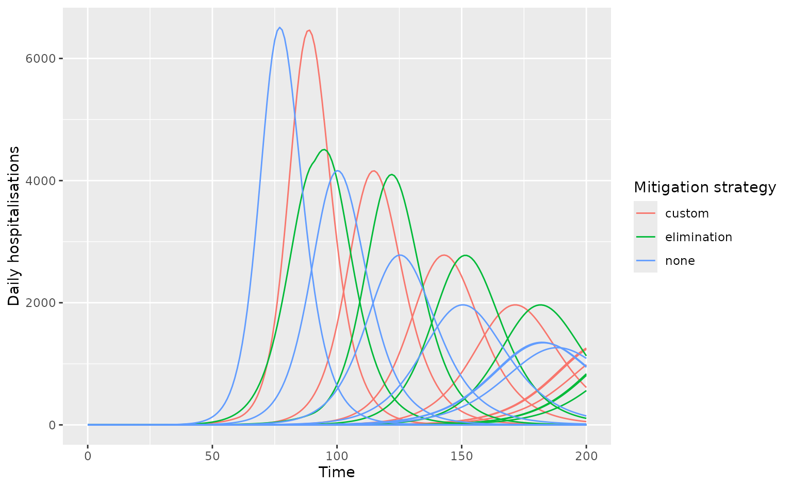

# ji-rpkg-template

This example shows how to model multiple pandemic response scenarios in
the U.K. with uncertainty in \\R_0\\ of an H1N1-like infection. **Note
that** *daedalus.compare* only supports running
[`daedalus::daedalus_multi_infection()`](https://jameel-institute.github.io/daedalus/reference/daedalus_multi_infection.html)
using
[`daedalus.compare::run_scenarios()`](https://jameel-institute.github.io/daedalus.compare/reference/run_scenarios.md)
at present.

``` r
library(daedalus) # needed only for custom NPIs
library(daedalus.compare)

# make list of infection objects with R0 of 1.0 -- 2.0 with skewed distribution
infection_list <- make_infection_samples(
  "influenza_2009",
  param_distributions = list(
    r0 = distributional::dist_beta(2, 5)
  ),
  param_ranges = list(
    r0 = c(1.0, 2.0)
  ),
  samples = 10
)

# create a timed intervention based on the elimination strategy
elimination <- daedalus_timed_npi(
  start_time = 30,
  end_time = 90,
  openness = list(
    daedalus.data::closure_strategy_data[["elimination"]]
  ), # must be a list
  "GBR" # must specify country
)

# create a custom timed intervention
custom <- daedalus_timed_npi(
  start_time = 30,
  end_time = 60,
  openness = list(rep(0.5, 45)), # must be a list
  "GBR" # must specify country
)

# run multiple scenarios of outputs
output <- run_scenarios(
  "GBR", infection_list,
  response_strategy = list(
    none = NULL,
    elimination = elimination,
    custom = custom
  ),
  time_end = 200
)

# view output which is a data.table
output
#>       response time_end     output
#>         <char>    <num>     <list>
#> 1:        none      200 <list[10]>
#> 2: elimination      200 <list[10]>
#> 3:      custom      200 <list[10]>

# get epi-curve data
disease_tags <- sprintf("sample_%i", seq_along(infection_list))
epi_curves <- get_epicurve_data(output, disease_tags)
```

``` r
# plot epi-curve data showing daily hospitalisations
library(dplyr)
#> 
#> Attaching package: 'dplyr'
#> The following objects are masked from 'package:stats':
#> 
#>     filter, lag
#> The following objects are masked from 'package:base':
#> 
#>     intersect, setdiff, setequal, union
library(ggplot2)

epi_curves %>%
  filter(measure == "daily_hospitalisations") %>%
  ggplot(aes(time, value)) +
  geom_line(
    aes(col = response, group = interaction(tag, response))
  ) +
  labs(
    x = "Time", y = "Daily hospitalisations",
    col = "Mitigation strategy"
  )
```


